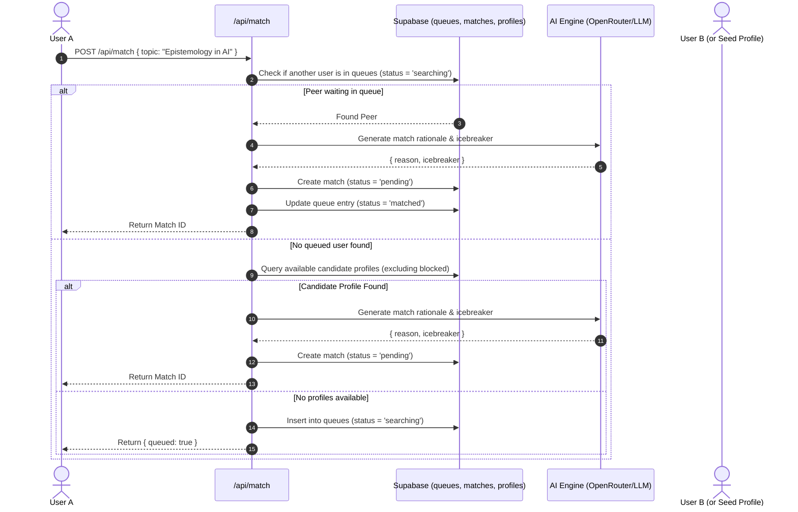
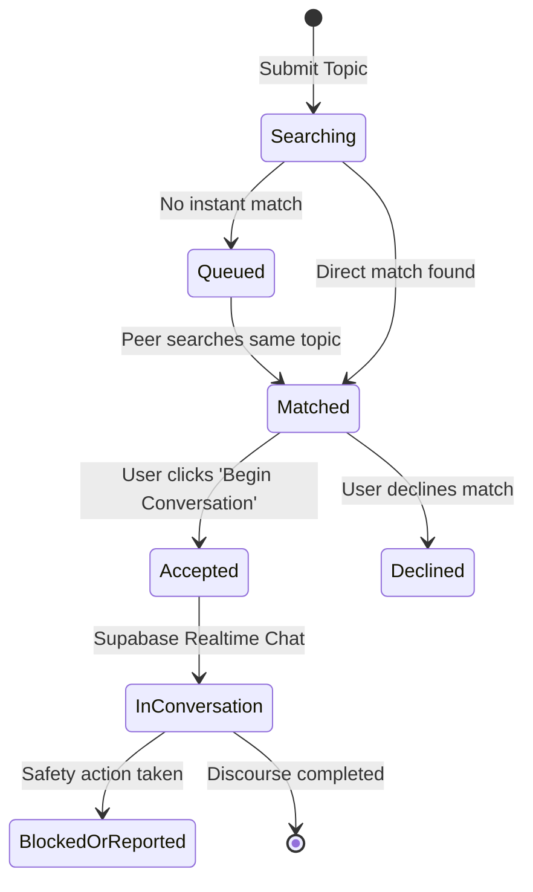

# Confluence

> **Quiet, intentional 1:1 intellectual conversations.**  
> Built for thoughtful discourse, powered by Next.js, Supabase Realtime, and Generative AI.

[](https://nextjs.org/)
[](https://react.dev/)
[](https://www.typescriptlang.org/)
[](https://tailwindcss.com/)
[](https://supabase.com/)

---

## 📖 Table of Contents

- [Overview](#-overview)
- [Key Features](#-key-features)
- [System Architecture](#-system-architecture)
- [Tech Stack](#-tech-stack)
- [Prerequisites](#-prerequisites)
- [Environment Variables](#-environment-variables)
- [Getting Started](#-getting-started)
- [Database Setup & Seeding](#-database-setup--seeding)
- [Project Structure](#-project-structure)
- [Testing](#-testing)
- [Design Philosophy](#-design-philosophy)
- [License & Acknowledgments](#-license--acknowledgments)

---

## 🌿 Overview

**Confluence** is a sanctuary from the noisy, algorithmic feed of the modern internet. Designed around a **Modern Editorial** aesthetic, it pairs thinkers, readers, and creators for asynchronous or real-time 1-on-1 dialogues centered around niche topics of mutual curiosity.

Instead of endless scrolling or superficial profiles, Confluence facilitates meaningful connections through:
1. **Curated Topic Search & Matchmaking**: Enter an intellectual pursuit or philosophical question. The system either pairs you with another active conversationalist interested in the topic or adds your inquiry to a real-time queue.
2. **AI-Assisted Onboarding & Context**: An AI interviewer poses probing follow-up questions to help you refine your bio into an editorial summary, and generates personalized match rationales and icebreakers.
3. **Live 1:1 Discourse**: Private, distraction-free messaging backed by Supabase Realtime channels.
4. **Safety & Editorial Control**: Integrated blocking, report workflows, and queue cancellation controls.

---

## ✨ Key Features

- **Intelligent 1:1 Matching Engine**
  - Instant pairing against searching users or curated conversationalist profiles.
  - Automatic fallback into a persistent **Queued Topics** list when no immediate match exists.
  - Cross-queue matching: when another user searches for a topic you are queued for, the match is formed automatically.

- **AI-Enhanced Onboarding & Icebreakers**
  - **Conversational Bio Generation**: An LLM agent asks a single, thoughtful follow-up question based on your interests, compiling your responses into a high-end first-person bio.
  - **Contextual Icebreakers**: When two users are matched, an AI creates a bespoke explanation of why the match makes sense and provides an opening conversation prompt.

- **Real-Time Discourse (Chat)**
  - WebSocket-based instant messaging via Supabase Realtime publications.
  - Match acceptance flow (`pending` ➔ `accepted` / `declined`).
  - Read states, timestamps, and message history.

- **Chats & Queues Dashboard**
  - View **Active Discourse** (accepted dialogues in progress).
  - Track **Queued Topics** (searches currently awaiting matching peers) with one-click cancellation.

- **Trust & Safety Controls**
  - In-chat modal for reporting inappropriate conduct and blocking users.
  - Automatic exclusion of blocked profiles from matchmaking.
  - Account deletion cascade adhering to data privacy standards.

- **Modern Editorial Aesthetic**
  - Inspired by high-end literary journals: cream/paper surfaces (`#faf9f8`), deep slate/teal ink typography, and custom typography pairing (`Source Serif 4` + `Geist`).

---

## 🏛️ System Architecture

### 1. Matchmaking & Queue Flow



### 2. Real-Time Chat Lifecycle



---

## 🛠️ Tech Stack

| Layer | Technology | Purpose |
| :--- | :--- | :--- |
| **Framework** | [Next.js 16](https://nextjs.org/) (App Router) | Server-side rendering, API routes, route handlers |
| **UI Library** | [React 19](https://react.dev/) | Client component state, reactive interactions |
| **Styling** | [Tailwind CSS v4](https://tailwindcss.com/) | Design tokens, responsive utilities, editorial styling |
| **Database** | [PostgreSQL via Supabase](https://supabase.com/) | Relational store for profiles, queues, matches, and messages |
| **Authentication** | [Supabase Auth](https://supabase.com/auth) | Email/Password and OAuth session management with SSR |
| **Realtime** | [Supabase Realtime](https://supabase.com/realtime) | WebSocket message subscriptions (`postgres_changes`) |
| **AI / LLM** | [OpenRouter](https://openrouter.ai/) / [OpenAI SDK](https://github.com/openai/openai-node) | Dynamic bio creation, match reasoning, icebreaker generation |
| **Icons** | [Lucide React](https://lucide.dev/) | Consistent, clean iconography |
| **Testing** | [Jest](https://jestjs.io/) & [Playwright](https://playwright.dev/) | Unit, component, and end-to-end integration tests |

---

## 📋 Prerequisites

Before running Confluence, ensure you have the following installed:

- **Node.js**: `v20.x` or `v18.x` ([Download Node.js](https://nodejs.org/))
- **Package Manager**: `npm` (comes with Node.js) or `pnpm` / `yarn`
- **Supabase Account**: A free cloud project at [supabase.com](https://supabase.com) (or a local Supabase CLI instance)
- **OpenRouter API Key**: Obtain a key from [openrouter.ai/keys](https://openrouter.ai/keys) (or any OpenAI-compatible API, such as Alibaba Cloud DashScope / Qwen)

---

## 🔐 Environment Variables

Create a file named `.env.local` in the root directory. You can copy the provided template:

```bash
cp .env.example .env.local
```

Populate the variables with your credentials:

| Variable Name | Required | Description | Example / Source |
| :--- | :---: | :--- | :--- |
| `NEXT_PUBLIC_SUPABASE_URL` | **Yes** | Your Supabase project REST URL. | `https://your-project.supabase.co` (*Project Settings > API*) |
| `NEXT_PUBLIC_SUPABASE_ANON_KEY` | **Yes** | Your Supabase public anonymous API key. Safe for browser exposure. | `sb_publishable_...` (*Project Settings > API*) |
| `SUPABASE_SERVICE_ROLE_KEY` | Optional | Supabase service role secret. Required for privileged server operations (e.g., account deletion, admin overrides). | `eyJhbGciOi...` (*Project Settings > API*) |
| `OPENROUTER_API_KEY` | **Yes** | API key used to query LLMs for bio compilation, match rationale, and icebreaker generation. | `sk-or-v1-...` (*openrouter.ai/keys*) |

> [!TIP]
> By default, `src/lib/ai.ts` connects through OpenRouter (`openrouter/free` model tier). You can also configure Alibaba Cloud Model Studio (DashScope / Qwen) or standard OpenAI endpoints by changing the `baseURL` and model identifier in `src/lib/ai.ts`.

---

## 🚀 Getting Started

Follow these steps to set up and run Confluence locally:

### 1. Clone the Repository
```bash
git clone https://github.com/your-username/confluence.git
cd confluence
```

### 2. Install Dependencies
```bash
npm install
```

### 3. Configure Environment Variables
Copy `.env.example` to `.env.local` and add your Supabase and OpenRouter keys:
```bash
cp .env.example .env.local
```

### 4. Set Up the Database
Follow the [Database Setup & Seeding](#-database-setup--seeding) section below to initialize your Supabase schema and load sample conversationalists.

### 5. Start the Development Server
```bash
npm run dev
```

Visit **[http://localhost:3000](http://localhost:3000)** in your browser.

---

## 🗄️ Database Setup & Seeding

Confluence uses Supabase for authentication, profiles, matchmaking queues, matches, and real-time messaging.

### Step 1: Execute the Database Schema
1. Open your [Supabase Project Dashboard](https://supabase.com/dashboard).
2. Navigate to the **SQL Editor** from the left navigation bar.
3. Open [`supabase_schema.sql`](./supabase_schema.sql) in this repository, copy its contents, paste them into the SQL Editor, and click **Run**.

This will:
- Create the core tables: `profiles`, `queues`, `matches`, `messages`.
- Enable **Row Level Security (RLS)** and apply security policies for each table.
- Create an automated trigger `on_auth_user_created` that instantiates a user profile whenever an account is created.
- Enable **Supabase Realtime** on the `messages` table for instant messaging.

### Step 2: Seed Sample Conversationalists (Optional but Recommended)
To test matchmaking immediately without needing multiple devices:
1. In the Supabase **SQL Editor**, open a new query.
2. Copy the contents of [`seed.sql`](./seed.sql), paste into the editor, and click **Run**.

This populates 15 pre-configured thinkers (e.g., Alice, Bob, Charlie, Diana) with distinct avatars and varied intellectual bios ranging from cognitive science to astrophysics.

---

## 📁 Project Structure

```text
confluence/
├── src/
│   ├── app/
│   │   ├── api/
│   │   │   ├── account/delete/    # Soft & hard account deletion cascade
│   │   │   ├── match/             # Core matchmaking & queue processing
│   │   │   └── onboarding/
│   │   │       ├── compile/       # AI bio generation endpoint
│   │   │       └── followup/      # AI follow-up question generator
│   │   ├── auth/                  # Supabase auth callback handlers
│   │   ├── chat/[id]/             # Real-time 1:1 discourse screen
│   │   ├── chats/                 # Chats & Queued topics dashboard
│   │   ├── login/                 # Authentication screen (Sign In / Register)
│   │   ├── match/[id]/            # Match preview, rationale, & icebreaker accept
│   │   ├── onboarding/            # Conversational multi-step bio onboarding
│   │   ├── profile/               # User profile display & bio review
│   │   ├── settings/              # Settings, block list, and account deletion
│   │   ├── globals.css            # Custom CSS tokens & typography variables
│   │   ├── layout.tsx             # Root layout with fonts & navigation
│   │   └── page.tsx               # Home landing & topic search discovery
│   ├── components/
│   │   └── ReportBlockModal.tsx   # Trust & safety modal (reporting & blocking)
│   ├── lib/
│   │   ├── ai.ts                  # OpenRouter / OpenAI LLM prompts & client
│   │   └── supabase/
│   │       ├── client.ts          # Browser Supabase client (Client Components)
│   │       ├── server.ts          # Server Supabase client (Server Components / Routes)
│   │       └── admin.ts           # Service role client for administrative duties
│   └── middleware.ts              # Next.js auth session refresh & route protection
├── public/                        # Static assets, SVG logos, and icons
├── DESIGN.md                      # Comprehensive design system & color tokens
├── supabase_schema.sql            # Complete PostgreSQL schema, RLS, and triggers
├── seed.sql                       # Sample profiles & conversationalists
├── .env.example                   # Environment variable template
├── package.json                   # Dependencies and npm scripts
└── README.md                      # Project documentation
```

---

## 🧪 Testing

The repository contains both unit/component tests and end-to-end browser tests.

### Run Unit & Component Tests (Jest)
```bash
npm test
```

### Run End-to-End Tests (Playwright)
```bash
npm run test:e2e
```

### Linting
```bash
npm run lint
```

---

## 🎨 Design Philosophy

Confluence adheres strictly to the **Modern Editorial** visual language documented in [`DESIGN.md`](./DESIGN.md):

- **Color Palette**:
  - `Surface`: Warm, tactile parchment tones (`#faf9f8` and `#f4f3f2`) avoiding harsh blinding whites.
  - `Ink`: Deep charcoals and dark spruce teals (`#1a1c1c`, `#032121`) for comfortable, book-like reading contrast.
  - `Accents`: Subtle sage green (`#cfe4dc`) and warm ochre for delicate status cues.
- **Typography**:
  - **Headings & Body**: `Source Serif 4` for a contemplative, literary cadence.
  - **Interface Elements & Metadata**: `Geist` for crisp, high-legibility microcopy and buttons.
- **Form & Spacing**:
  - Fixed-width reading column (max `720px`) for optimal line length (60-75 characters).
  - Clean hairline borders, subtle hover transitions, and generous vertical rhythm.

---

## 🛡️ Trust & Safety

- **Row Level Security (RLS)**: Enforced directly at the PostgreSQL layer. Users can only read and write messages in matches where they are explicit participants (`user1_id` or `user2_id`).
- **User Blocking**: Blocked users are recorded in the `blocks` table and filtered out during matchmaking queries so you will never be paired with a blocked peer.
- **Data Erasure**: Full GDPR-compliant cascade deletion allows users to delete their profile, active matches, and dialogue history anytime via `/settings`.

---

## 📄 License & Acknowledgments

This project is created for the **Alkhidmat Alibaba Cloud Hackathon**. Distributed under the [MIT License](https://opensource.org/licenses/MIT).
